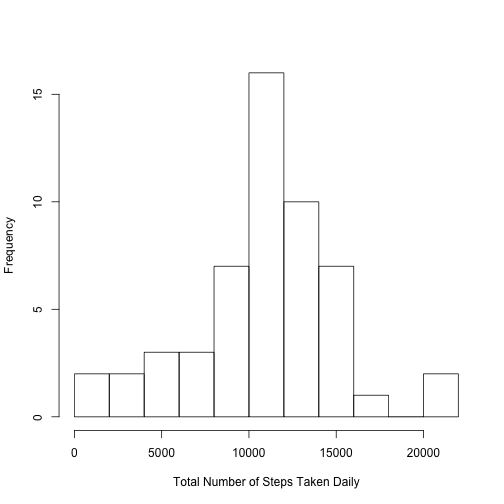
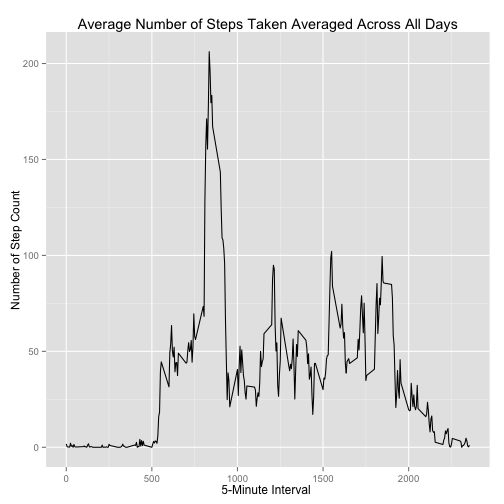
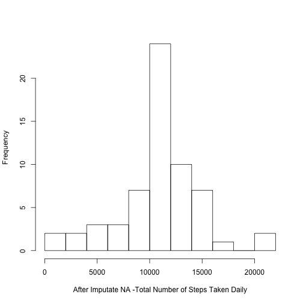
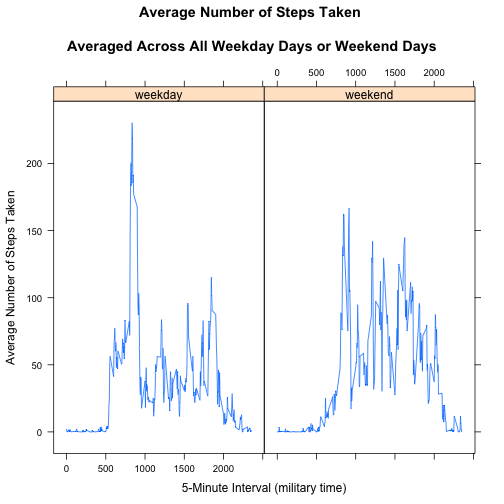

#Reproducible Research : Peer Assignment 1


##Initial Setup
For the purpose of assignment a directory "~/Desktop/Reproducible Research/Peer-Assignment-1/RepData_PeerAssessment1" is created on my MacBook .

The suggested GitHub repository "forked from rdpeng/RepData_PeerAssessment1" needed is forked and cloned  on my DeskTop.

The file "activity.zip" was unziped and activity.csv file is kept for further processing

##Data

The data for this assignment was  downloaded from the course web site:

    Dataset: Activity monitoring data [52K]

The variables included in this dataset are:

    steps: Number of steps taking in a 5-minute interval (missing values are coded as NA)

    date: The date on which the measurement was taken in YYYY-MM-DD format

    interval: Identifier for the 5-minute interval in which measurement was taken

The dataset is stored in a comma-separated-value (CSV) file and there are a total of 17,568 observations in this dataset.


##Setting Working Directory


```r
 setwd("~/Desktop/Reproducible Research/Peer-Assignment-1/RepData_PeerAssessment1")
```


##Reading Dataset  and preprocessing the data


```r
activity<-read.csv("activity.csv" , header=TRUE)
activity$date <- as.Date(activity$date) 
```
##Checking the contents of the Data

```r
dim(activity)
```

```
## [1] 17568     3
```

```r
head(activity)
```

```
##   steps       date interval
## 1    NA 2012-10-01        0
## 2    NA 2012-10-01        5
## 3    NA 2012-10-01       10
## 4    NA 2012-10-01       15
## 5    NA 2012-10-01       20
## 6    NA 2012-10-01       25
```


Note that the `echo = FALSE` parameter was added to the code chunk to prevent printing of the R code that generated the plot.


##What is mean total number of steps taken per day?

For this part of the assignment,  the missing values were ignored in the dataset.

    Make a histogram of the total number of steps taken each day

    Calculate and report the mean and median total number of steps taken per day


```r
activity.ignore.na <- na.omit(activity) 

# sum steps by date
daily.steps <- rowsum(activity.ignore.na$steps, format(activity.ignore.na$date, '%Y-%m-%d')) 
daily.steps <- data.frame(daily.steps) 
names(daily.steps) <- ("steps") 
```

Plot histogram of the total number of steps taken each day:


```r
hist(daily.steps$steps, 
     main=" ",
     breaks=10,
     xlab="Total Number of Steps Taken Daily")
```

 


Compute  mean and median of steps:


```r
mean(daily.steps$steps);
```

```
## [1] 10766.19
```

```r
median(daily.steps$steps)
```

```
## [1] 10765
```


##What is the average daily activity pattern?

Calculate average steps for each of 5-minute interval during a 24-hour period.
Make a time series plot (i.e. type = “l”) of the 5-minute interval (x-axis) and the average number of steps taken, averaged across all days (y-axis) 
Report which 5-minute interval, on average across all the days in the dataset, contains the maximum number of steps?
Observe and comment the average daily activity pattern


```r
library(plyr)
# Calculate average steps for each of 5-minute interval during a 24-hour period
interval.mean.steps <- ddply(activity.ignore.na,~interval, summarise, mean=mean(steps))
```
Plot time series of the 5-minute interval and the average number of steps taken, averaged across all days


```r
library(ggplot2)
qplot(x=interval, y=mean, data = interval.mean.steps,  geom = "line",
      xlab="5-Minute Interval ",
      ylab="Number of Step Count",
      main="Average Number of Steps Taken Averaged Across All Days"
      )
```

 

Report the 5-min interval, on average across all the days in the dataset, contains the maximum number of steps:


```r
interval.mean.steps[which.max(interval.mean.steps$mean), ]
```

```
##     interval     mean
## 104      835 206.1698
```

Observations:

Based on steps taken pattern, the person's daily activity peaks around 835th  5-minute interval 


##Imputing missing values

There are a number of days/intervals where there are missing values (coded as NA). The presence of missing days may introduce bias into some calculations or summaries of the data. In this section:

    Calculate and report the total number of missing values in the dataset (i.e. the total number of rows with NAs)
    Implement a strategy for filling in all of the missing values in the dataset. For this assignment the strategy is to use the mean for that 5-minute interval to replace missing valuse. Create a new dataset that is equal to the original dataset but with the missing data filled in.
    Make a histogram of the total number of steps taken each day
    Calculate and report the mean and median total number of steps taken per day.
    Make following comments: Do these values differ from the estimates from the first part of the assignment? What is the impact of imputing missing data on the estimates of the total daily number of steps?

Calculate and report the total number of missing values in the dataset (i.e. the total number of rows with NAs)


```r
library(sqldf)
```

```
## Loading required package: gsubfn
## Loading required package: proto
```

```
## Warning in doTryCatch(return(expr), name, parentenv, handler): unable to load shared object '/Library/Frameworks/R.framework/Resources/modules//R_X11.so':
##   dlopen(/Library/Frameworks/R.framework/Resources/modules//R_X11.so, 6): Library not loaded: /opt/X11/lib/libSM.6.dylib
##   Referenced from: /Library/Frameworks/R.framework/Resources/modules//R_X11.so
##   Reason: image not found
```

```
## Could not load tcltk.  Will use slower R code instead.
## Loading required package: RSQLite
## Loading required package: DBI
```


```r
tNA <- sqldf(' 
    SELECT d.*            
    FROM "activity" as d
    WHERE d.steps IS NULL 
    ORDER BY d.date, d.interval ')
```


```r
NROW(tNA) 
```

```
## [1] 2304
```
Implement a strategy for filling in all of the missing values in the dataset. For this assignment the strategy is to use the mean for that 5-minute interval to replace missing valuse. Create a new dataset (t1) that is equal to the original dataset but with the missing data filled in. The dataset is ordered by date and interval. The following SQL statement combines the original “data” dataset set and the “interval.mean.steps” dataset that contains mean values of each 5-min interval ageraged across all days.


```r
t1 <- sqldf('  
    SELECT d.*, i.mean
    FROM "interval.mean.steps" as i
    JOIN "activity" as d
    ON d.interval = i.interval 
    ORDER BY d.date, d.interval ') 

t1$steps[is.na(t1$steps)] <- t1$mean[is.na(t1$steps)]
```


In the following, prepare data for plotting histogram calculate mean and median:


```r
t1.total.steps <- as.integer( sqldf(' 
    SELECT sum(steps)  
    FROM t1') );

t1.total.steps.by.date <- sqldf(' 
    SELECT date, sum(steps) as "t1.total.steps.by.date" 
    FROM t1 GROUP BY date 
    ORDER BY date') 
```


```r
daily.61.steps <- sqldf('   
    SELECT date, "t1.total.steps.by.date" as "steps"
    FROM "t1.total.steps.by.date"
    ORDER BY date') 
```
Plot  a histogram of the total number of steps taken each day.

```r
hist(daily.61.steps$steps, 
     main=" ",
     breaks=10,
     xlab="After Imputate NA -Total Number of Steps Taken Daily")
```

 
Calculate and report the mean and median total number of steps taken per day. 


```r
t1.mean.steps.per.day <- as.integer(t1.total.steps / NROW(t1.total.steps.by.date) )
t1.mean.steps.per.day
```

```
## [1] 10766
```

```r
t1.median.steps.per.day <- median(t1.total.steps.by.date$t1.total.steps.by.date)
t1.median.steps.per.day
```

```
## [1] 10766.19
```


Points to be noted:

    Do these values (mean and median) differ from the estimates from the first part of the assignment? Not Really.

    What is the impact of imputing missing data on the estimates of the total daily number of steps? The shape of the histogram remains the same as the histogram from removed missing values. However, the frequency counts increased as expected. In this case, it seems that the data imputation strategy should work for the downstream data analysis and modeling.


##Are there differences in activity patterns between weekdays and weekends?


    Use the dataset with the filled-in missing values for this part. Create a new factor variable in the dataset with two levels – “weekday” and “weekend” indicating whether a given date is a weekday or weekend day.
    Make a panel plot containing a time series plot (i.e. type = “l”) of the 5-minute interval (x-axis) and the average number of steps taken, averaged across all weekday days or weekend days (y-axis).

Create a factor variable weektime with two levels (weekday, weekend). The folowing dataset t5 dataset contains data: average number of steps taken averaged across all weekday days and weekend days, 5-min intervals, and a facter variable weektime with two levels (weekday, weekend).


```r
t1$weektime <- as.factor(ifelse(weekdays(t1$date) %in% 
                c("Saturday","Sunday"),"weekend", "weekday"))

t5 <- sqldf('   
    SELECT interval, avg(steps) as "mean.steps", weektime
    FROM t1
    GROUP BY weektime, interval
    ORDER BY interval ')
```

Make a panel plot containing a time series plot (i.e. type = “l”) of the 5-minute interval (x-axis) and the average number of steps taken, averaged across all weekday days or weekend days (y-axis).


```r
library("lattice")
p <- xyplot(mean.steps ~ interval | factor(weektime), data=t5, 
       type = 'l',
       main="Average Number of Steps Taken 
       \nAveraged Across All Weekday Days or Weekend Days",
       xlab="5-Minute Interval (military time)",
       ylab="Average Number of Steps Taken")
print (p)    
```

 


Points To be noted:

    Are there differences in activity patterns between weekdays and weekends? Yes. The plot indicates that the person moves around more (or more active) during the weekend days


##Conclusion

This assignment is purely to demonstrate concept of Reproducible Research using Knitr and Rmd coding.

The data analysis started from loading data, transform data including the strategy and implementation of dealing with missing data, and reporting statistical data and plots. 


My firends who are taking the course should be able to follow the document and reproduce the same results. 

The document was prepared with RStudio Version 0.98.1103  on Mac OS X v10.10.4 Yosemite


Thank you all ...
